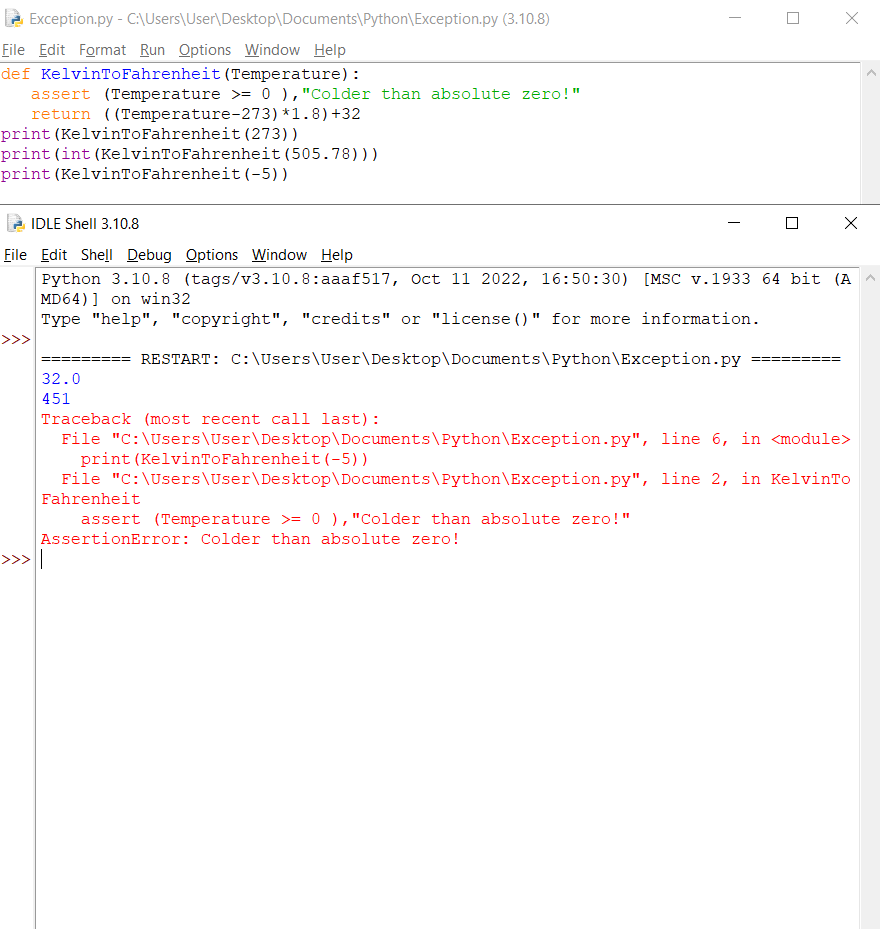
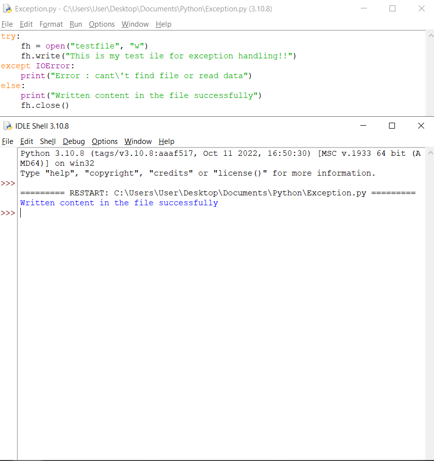
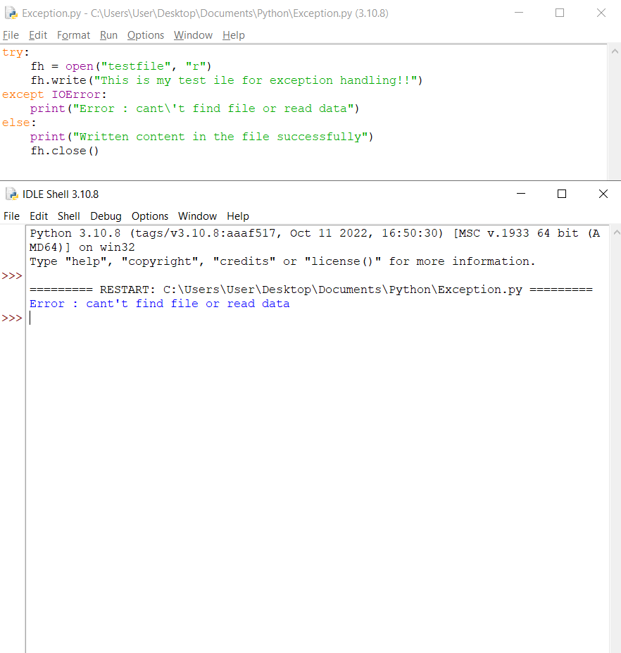
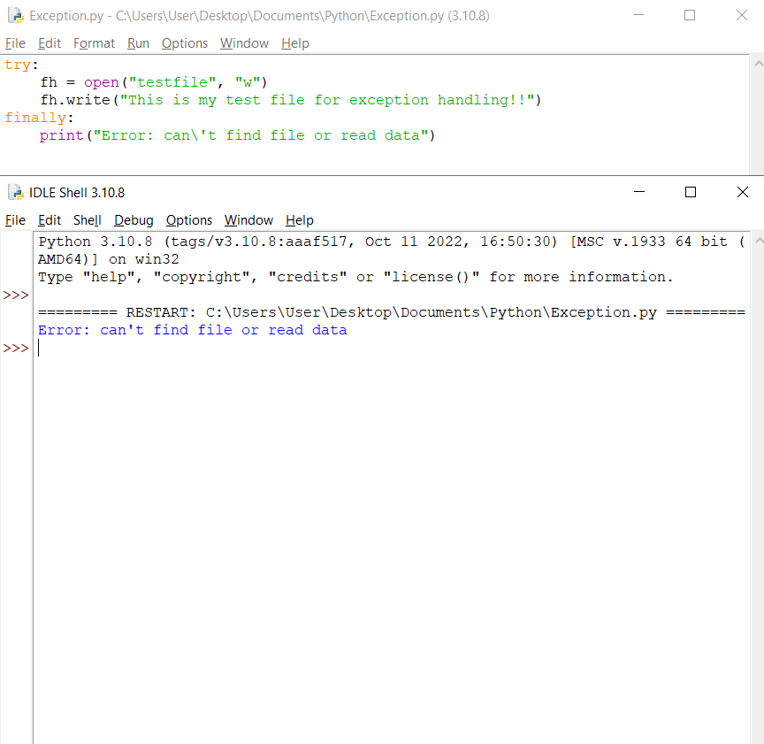
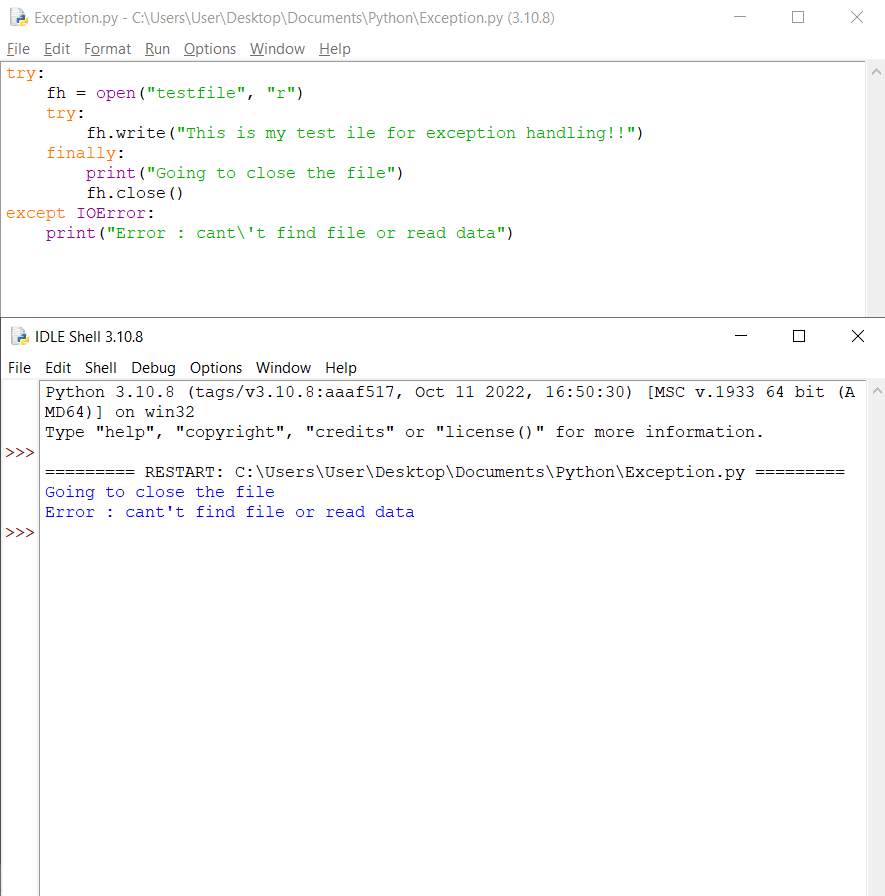
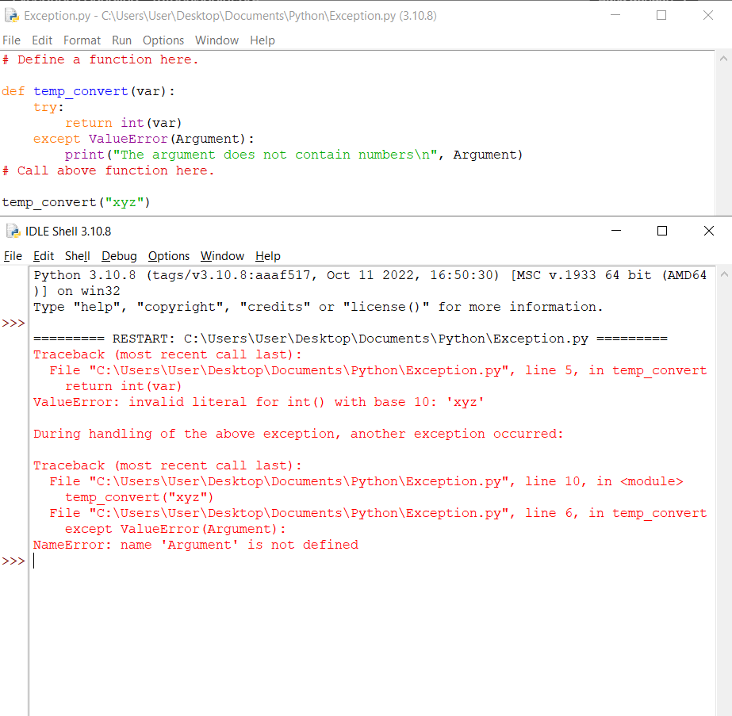
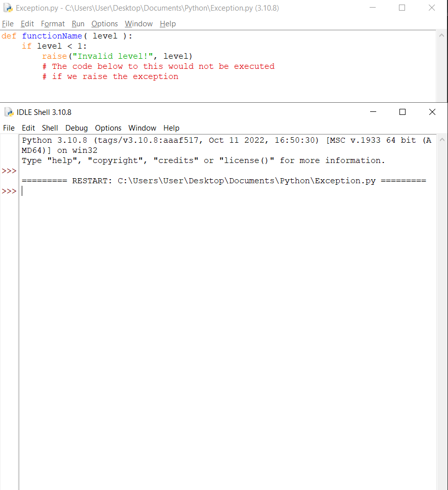
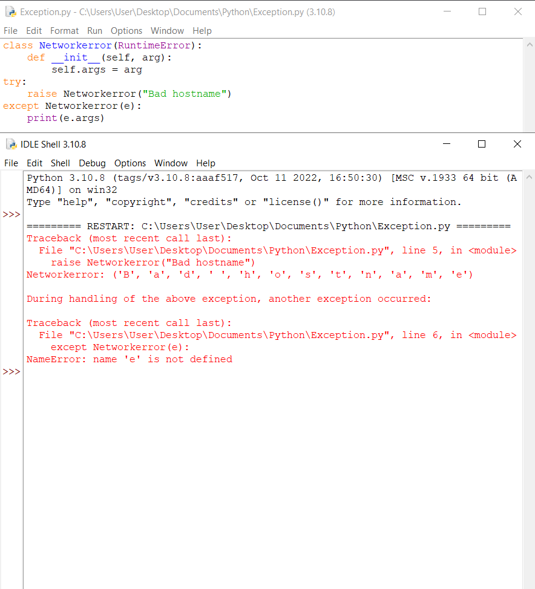

### Nama : Veronika Natalia Kala
### NIM  : 312210690
### Kelas : TI.22.A.2
# Praktikum 9 
## Exception and Handling
#### Contoh Assert Statement
- Ketika kode di bawah dijalankan, menghasilkan hasil sebagai berikut:

- Jika pernyataan gagal, Python menggunakan ArgumentExpression ArgumentExpression sebagai argumen argumen untuk AssertionError AssertionError. Pengecualian AssertionError Pengecualian AssertionError dapat ditangkap dan ditangani ditangani seperti pengecualian lainnya menggunakan try- kecuali pernyataan, tetapi jika dibiarkan, mereka akan menghentikan program dan menghasilkan backtrace.
#### ContohHandling an Exception
- Contoh-contoh ini membuka file, menulis konten file, dan keluar dengan aman karena ada tidak masalah
- Ketika kode di bawah dijalankan, menghasilkan hasil sebagai berikut:

- Contoh ini mencoba membuka file yang Anda tidak memiliki izin menulis, sehingga membuat file pengecualian
- Ketika kode di bawah dijalankan, menghasilkan hasil sebagai berikut:

#### Contoh The try-finally Clause
- Ketika exception dilempar ke dalam blok try, eksekusi segera dilanjutkan ke akhir memblok. Setelah semua pernyataan di blok akhirnya dieksekusi, pengecualian dimunculkan lagi dan ditangani dalam pernyataan kecuali jika ada di lapisan berikutnya yang lebih tinggi dari percobaan-kecuali penyataan.
- Ketika kode di bawah dijalankan, menghasilkan hasil sebagai berikut:
- Jika Anda tidak memiliki izin untuk membuka file dalam mode tulis yang dapat ditulis, maka ini akan menghasilkan hasil berikut:

- Contoh yang sama dapat ditulis lebih bersih sebagai berikut:

#### Contoh Argument of an Exception
- Berikut adalah contoh untuk satu pengecualian
- Ketika kode di bawah dijalankan, menghasilkan hasil sebagai berikut:

#### Contoh Raising an Exception
- Pengecualian dapat berupa string, kelas, atau objek. Sebagian besar pengecualian adalah pengecualian dari inti Python menimbulkan adalah kelas, dengan argumen=argumen yang merupakan turunan dari kelas. Mendefinisikan pengecualian barucukup mudah dan dapat dilakukan sebagai berikut:

#### Contoh User-Defined Exception
- Python juga memungkinkan Anda membuat pengecualian sendiri dengan menurunkan kelas-kelas dari yang standar pengecualian bawaan.
- Berikut adalah contoh-contoh yang terkait dengan RuntimeError. Di sini, kelas dibuat yang merupakan subkelas dari subkelas RuntimeError. Ini berguna saat Anda perlumenampilkan tampilan informasi yang lebih spesifik saat e pengecualian tertangkap.
- Di blok coba, pengecualian yang ditentukan pengguna dimunculkan dan ditangkap di blok kecuali. Itu variabel e digunakan untuk membuat instance dari kelas Networkerror.
- Ketika kode di bawah dijalankan, menghasilkan hasil sebagai berikut:

